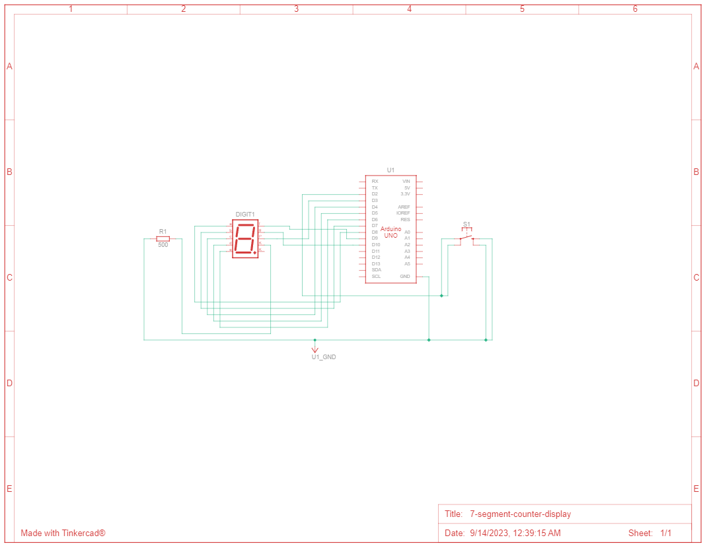
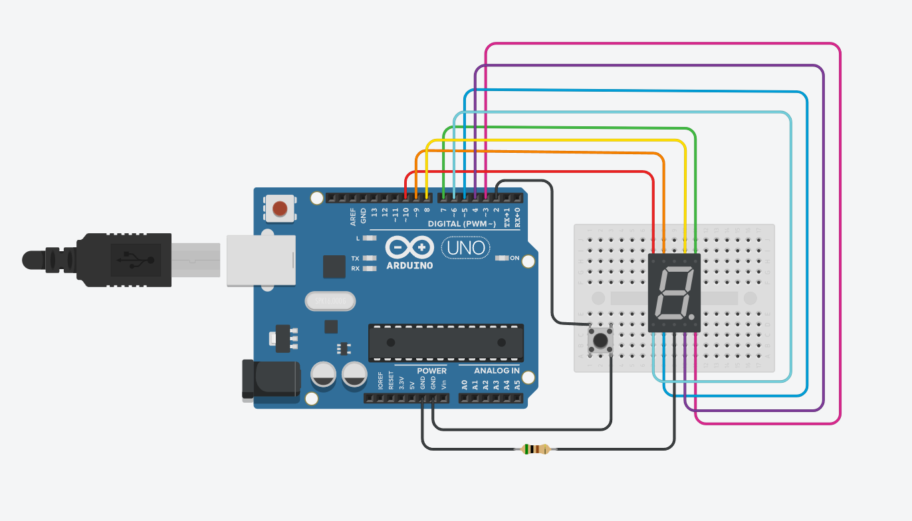

# 7 Segment Counter Display

The goal is to create a system using an Arduino Uno that displays a count from 0 to 7 on a 7-segment display. The count should be triggered every time a button is pressed, with a 1-second interval between each number.

## 📦 Components

|Name  |Quantity|Component                  | Usage                   |
|------|--------|---------------------------|-----------------------|
|U1    |1       | Arduino Uno R3            |Use an Arduino Uno as the main control board.           |
|R1    |1       | 500 Ω Resistor            |Use it to limit the current of the internal circuit of the display.            |
|Digit1|1       | Cathode 7 Segment Display |Connect a 7-segment display to the Arduino Uno to show numbers from 0 to 7.           |
|S1    |1       | Pushbutton                |Connect a pushbutton to one of the digital pins of the Arduino Uno.           |
|R2    |1       | pull-up Resistor          |Connect a pull-up resistor between the button pin and Vcc (power supply voltage).            |

## 🤖 settings

| Schematic  | Circuit View |
|:----------:|:------------:|
|||

**Arduino Countdown Implementation:**

**1. Hardware Setup:**
   - 🧩 Connect the 7-segment display to the Arduino Uno.
   - 🌐 Wire the button and enable the pull-up resistor for proper functionality.

**2. Programming Steps:**
   - In your Arduino code:

     - 🚀 Initialize the display and Configure the button for input.
     - 📊 Define a count variable (initially set to 0).
     - ⏰ Set up a timer for 1-second updates.
     - ✅ On button press, increment the count and display it.
     - 🔄 Update the display with the count every second.
     - 🔄 Reset the count to 0 when it reaches 7.
     - 🔄 Maintain a continuous loop for button and timer events.
    
   **Solution:**
   ```c
   int main(void){
     DDRD = 0xF8;
     DDRB = 0x07;
     unsigned int counter = 0;
     
     zero(); // start display with zero;
     
     void (*display_num[8])() = {zero, one, two, three, four, five, six, seven};
   
     while(1){
       if(PIND & 0x04){ continue; } // the button was not pressed
       
       counter++;
       
       if (counter <= 7) {
         display_num[counter]();
       } else {
         zero();
         counter = 0;
       }
       
       _delay_ms(1000);
     }
     
     return 0;
   }
   ```

**3. Compilation and Uploading:**
   - Use the Arduino IDE to compile and upload your code to the Arduino Uno.

**4. Observing the Countdown:**
   - Press the button to initiate the countdown on the 7-segment display.
   - Each number will appear at 1-second intervals. 🚀🔢

## Simulation

Platform: [Tinkercad.com](https://www.tinkercad.com/).

Watch the simulation video here[here](https://youtu.be/u1XYF1FV1Q8).

## 🫂 Authors

- [Ernane Ferreira](https://github.com/ernanej)
- [Quelita Mirian](https://github.com/quelita2)
- [Thiago Lopes](https://github.com/thiagonasmto)

